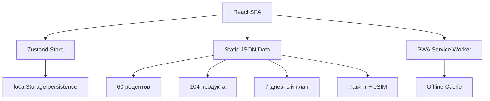

# ⛵ Yacht Shopping List

Веб-приложение для подготовки к 7-дневному яхтенному путешествию на Сейшелы (8 человек, 4 каюты).

**Live:** http://153.80.244.132/

## Возможности

- **Список покупок** — 104 позиции по 13 категориям с прогрессом, поиском, фильтрами и кнопками ±
- **Рецепты** — 60 рецептов для готовки на плите (без духовки), индикатор готовности по купленным ингредиентам
- **План питания** — 7 дней × 4 приёма пищи, ежедневные рыбные блюда из свежего улова
- **Сборы** — личный пакинг-лист (44 позиции), хозтовары (35 позиций), сравнение eSIM провайдеров
- **PWA** — работает офлайн, устанавливается на телефон
- **Тёмная тема** — переключатель в шапке
- **Mobile-first** — оптимизировано для использования с телефоном в магазине

## Стек

```
React 18 + TypeScript + Vite + Tailwind CSS 4
Zustand (state management)
vite-plugin-pwa (offline support)
Nginx (deploy)
```

## Архитектура



Данные встроены в бандл как JSON — не требуется бэкенд для базовой работы.
Состояние чекбоксов хранится в localStorage через Zustand persist.

## Локальная разработка

```bash
npm install
npm run dev     # http://localhost:5173
npm run build   # production build → dist/
```

## Деплой

Текущий деплой: статические файлы на VPS с Nginx.

```bash
npm run build
scp -r dist/* user@server:/var/www/yacht/
```

Nginx конфиг:
```nginx
server {
    listen 80;
    root /var/www/yacht;
    index index.html;
    location / { try_files $uri $uri/ /index.html; }
}
```

## Структура проекта

```
src/
├── components/
│   ├── layout/          # Header, BottomNav
│   ├── list/            # ShoppingList, ListItem, SearchBar, ProgressBar, FilterBar
│   ├── recipes/         # RecipesPage
│   ├── mealplan/        # MealPlanPage
│   └── packing/         # PackingPage (пакинг, хозтовары, eSIM)
├── data/                # JSON data (gastronomy, household)
├── store/               # Zustand store
├── types/               # TypeScript interfaces
└── styles/              # Tailwind globals
```

## Данные

| Категория | Количество |
|---|---|
| Рецепты | 60 (только плита/сковорода/кастрюля) |
| Рыбные блюда | 15 (свежий улов каждый день) |
| Продукты в списке | 104 |
| Категории продуктов | 13 |
| Дней в плане | 7 × 4 приёма пищи |
| Вода | 112 л (2л/чел/день) |
| Хозтовары | 35 позиций |
| Личные вещи | 44 позиции |
| eSIM провайдеры | 5 |
